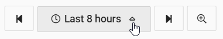
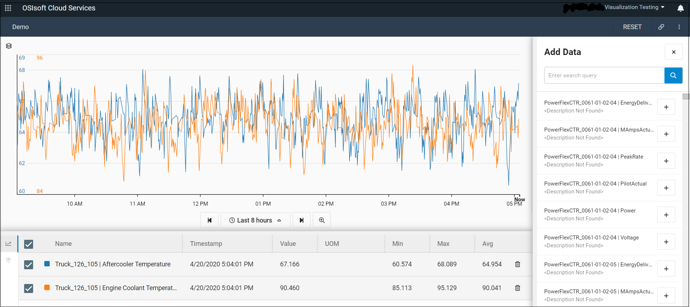
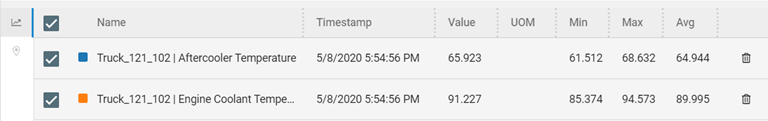

Getting Started with Remote Operations Monitoring
=================================================

OSIsoft Cloud Services (OCS) makes it possible to monitor remote assets in real
time. The immediate access to data about the status of assets gives you the
ability to anticipate problems and proactively perform preventative maintenance.

For example, a fleet manager of a mining truck dealer sells trucks to companies
worldwide. His company provides monitoring and maintenance services to their
customers. With remote monitoring, he reviews the status of the trucks each day,
identifies trucks with problems, uses the data collected on different
measurements to identify possible causes, reviews the history of these
measurements over time, and shares the information with colleagues in the field
who can follow up on the problem.

The following procedure describes how to use the OCS Portal to monitor your
assets and quickly identify problems. The screen captures are taken from the
scenario described in the example above.

Procedure
---------

1.  Log in to OSIsoft Cloud Services.

2.  Click the navigation icon

and click **Asset Explorer** (under Visualization).

The Asset Explorer displays the available assets. In this example, it provides
an overview of the health of the fleet of trucks.

Note: Click on the icons to toggle between the card and table views of the
assets.

    Card/Table View

1.  Scan through the assets and identify any assets with a problematic status.

-   \<\>

    Note: Use the Search box to filter the list of assets displayed.

|        | Status  |
|--------|---------|
| Green  | Good    |
| Yellow | Warning |
| Red    | Bad     |

1.  Click on the asset to open the Asset Details pane.

-   The Asset Details pane provides attribute and measurement data on the asset
    that you can use to determine the cause of any problems. The Attributes tab
    displays metadata associated with the asset.

    

    Asset Attributes

1.  Click the **Measurements** tab.

-   The Asset Details pane displays the following:

    -   Data associated with the asset. These values are updated in real time.

    -   A trend of the selected measurements.

    

    Details pane

1.  Select one or more of the measurements which you think might be the cause
    for the warning.

2.  Review the history of the selected measurements in the trend to see if the
    data suggests you have identified a potential cause.

-   By default, the trend shows the measurements for the last 8-hour period.
    Click the arrow to pick another time-range option or specify a custom time
    range.

    

    Time Range options

1.  To delve further into the details of these measurements, click the **View
    full trend**

    View full trend icon

    icon to see the Trend page.

    

    View full trend

    Note the following:

    -   The Trend page shows the measurements for the same time range shown in
        the Details pane of the Asset Editor.

    -   There are three views of the trend:

        -   Stacked mode – Each trace is displayed in its own trend.

        -   Single-scale mode – All measurements are plotted on the same scale.

        -   Multi-scale mode – All measurements are plotted on its own scale.

    Click on the

    

    Trend views icon

    icon to toggle through the views.

    The Legend table shows the legend for each trace, the last value, minimum,
    maximum, and average values in the displayed time range.

    

    Legend Table

1.  The error may not have occurred in the time range currently in view. Click
    **Step backward** or **Step forward** to move the time range backward or
    forward.

-   The trace will move in increments of time that are displayed in the trend.
    If the trend displays the last 12 hours, **Step backward** shows the
    previous 12-hour period. If it displays the last 30 days, **Step forward**
    shows the next 30-day period.

    

    Step back and step forward

1.  Click on a trace to select it for further analysis.

-   The trace is highlighted, and two cursors automatically mark the minimum and
    maximum values for the displayed time range.

    

    Maximum and minimum cursors

    Click the plus sign (+) above the trace to lock the cursor in place. The “+”
    turns into an “x.” Click the “x” to unlock the cursor.

1.  Add other cursors at data points of interest.

2.  Click the link icon

    Copy link icon

    in the menu bar to copy the URL of the workspace.

    This link, shared with colleagues, gives them the same view of the trend
    that they can then use to troubleshoot problems.
